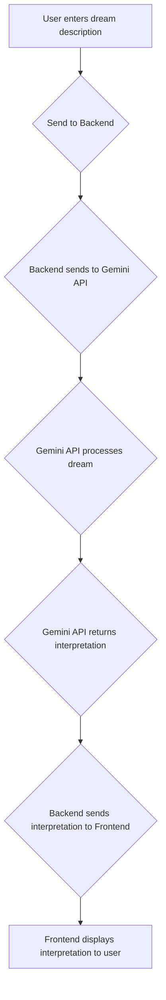

# Dream Interpretation AI

This is a web application that uses the Google Gemini API to interpret the meaning of dreams. The user can input a dream description, and the AI will provide a detailed interpretation based on common dream symbols and psychological theories.

## Flowchart



## Metrics

### Quantitative Metrics

*   **API Response Time:** The time it takes for the Gemini API to return an interpretation.
*   **User Satisfaction Score:** A rating (e.g., 1-5 stars) that users can give to each interpretation.
*   **Number of Interpretations:** The total number of dreams interpreted by the application.
*   **Error Rate:** The percentage of API calls that result in an error.

### Qualitative Metrics

*   **Interpretation Quality:** The coherence, relevance, and insightfulness of the dream interpretations. This can be measured through user feedback and expert review.
*   **User Feedback:** Open-ended feedback from users about their experience with the application.
*   **Usefulness:** How helpful users find the interpretations in understanding their dreams.

## Features

- **Dream Input:** A simple and intuitive interface for users to write down their dreams.
- **AI-Powered Interpretation:** Leverages the power of the Google Gemini API to provide insightful and detailed dream interpretations.
- **Modern UI:** A clean and modern user interface built with React and Tailwind CSS.

## Tech Stack

- **Frontend:** React, Vite, Tailwind CSS
- **Backend:** Express.js, Node.js
- **AI:** Google Gemini API
- **Language:** TypeScript

## Getting Started

### Prerequisites

- Node.js (v18 or higher)
- npm
- A Google Gemini API key

### Installation

1.  **Clone the repository:**

    ```bash
    git clone <repository-url>
    cd <repository-directory>
    ```

2.  **Install dependencies:**

    ```bash
    npm install
    ```

3.  **Set up environment variables:**

    Create a `.env` file in the root of the project and add your Google Gemini API key:

    ```
    GEMINI_API_KEY=<your-api-key>
    ```

### Running the Application

-   **Development mode:**

    ```bash
    npm run dev
    ```

    This will start the development server with hot-reloading.

-   **Production mode:**

    ```bash
    npm run build
    npm run start
    ```

    This will build the application for production and start the production server.
